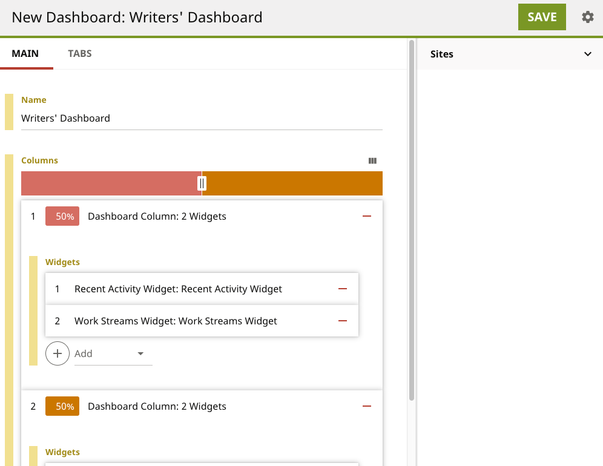
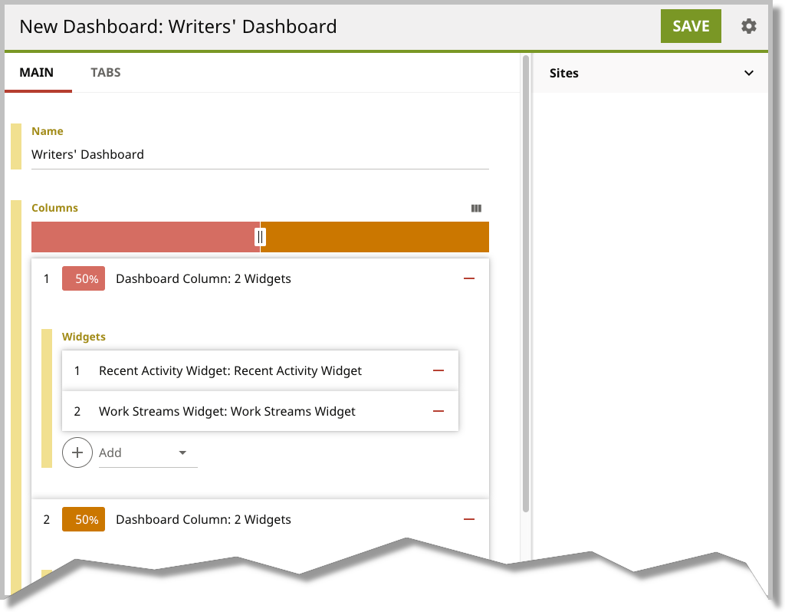

# Overview

Technical documentation often contains screen shots that are too long to be of use. In such cases a "torn page" effect is applied to give the reader a cue that only part of the screen appears in the screen shot.

The script in this repository applies a torn-page effect to any screen shot.

Before | After
------ | -----
 | 

# Requirements

* Linux or OS X
* ImageMagick
* An available directory `/tmp`

# Installation

* Download or clone the script into a directory.

# Usage
```
make_torn_page.sh <inputfile> 
```
* `inputfile` Any graphic file supported by ImageMagick (png, jpg, gif, etc.).

